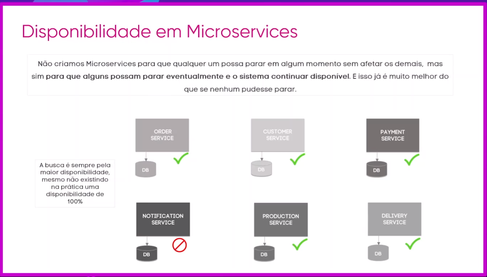

# Descodificando Microservices com Spring  
Evento Michelli Brito  

### -> Dia 18/10 (segunda-feira) - O fim dos Monolíticos  
Com os fim dos sistemas monolíticos é preciso saber mais do que apenas Java com Spring ou criação de APIs e para entender o que realmente te trará destaque no mercado nos dias de hoje e o que é preciso para receber as melhores remunerações acompanhe o primeiro dia do evento.  

É preciso criar sistemas Escaláveis, Disponíveis e Sustentáveis.  

### -> Dia 19/10 (terça-feira) - Fundamentos de Microservices  
Depois dos vários anos trabalhando com Microservices e diversos problemas enfrentados adquiri experiência e maturidade que quero compartilhar com vocês, vou discutir premissas essenciais sobre sistemas distribuídos e também trarei esclarecimentos sobre equívocos que geralmente causam confusão sobre Microservices.  

Exemplo de monolito.  
  

Exemplo de Microserviços. 
 

Na arquitetura é preciso definir softwares com Alta disponibilidade e Manutenbilidade.
  

A arquitetura envolve desde conceitos tecnicos, até financeiros e gerenciais, moldados de acordo com a necessidade do negócio.  

Outro ponto a ser pensado é sobre a sincronia de dados, pois os bancos de dados estão separados.  
Consistência de dados é quando garantimos a integridade, não temos divergência e nem ambiguidade de dados dentro da aplicação.  
Quando os dados em todas as bases são replicados e atualizados.  
Porém não é possível garantir 100% de consistência com 100% de disponibilidade, é preciso fazer um trade off de acordo com a necessidade do negócio, por exemplo quando os dados de service de cliente são atualizados ou um novo cliente é criado, não é necessário deixar o service de pagamentos indisponível, pode ser feito o pagamento, e em outro momento os dados serem replicados do cliente para o pagamento.  
  

Consistencia VS Disponibilidade. Teorema CAP.  
Possui 3 pontas - Disponibilidade, Consistência e Partição, e diz que nunca teremos condições de priorizar essas 3 pontas, sempre apenas 2 serão priorizadas.  
Microservices já priorizam a partição por se tratar de sistemas distribuídos, no caso precisamos pensar na arquitetura em um balanceamento entre as outras duas pontas.  
  

Nesse caso existe uma consistencia eventual, pois os dados ficam por um tempo desatualizados, porém em algum momento esse dados vai ser atualizado para o sistema como um todo.  

Identificadores UUIDs temporais são uma boa prática para serem utilizados em sistemas de dados distribuidos, para evitar conflitos de identificadores.  

Não existe desacoplamento absoluto em microservices, e sim um acoplamento fraco, o objetivo é otimizar o acoplamento o máximo possível de forma a criar a interdependencia entre os serviços minimamente.  
Esse dependencia não é arquitetural, deve ser definido de acordo com a nescessidade do negócio.  
  

Também não existe 100% de disponibilidade, os servicos sao criados de forma que alguns possam parar sem que afetem os demais, que é bem melhor do que nenhum parando.  
  

Também pode existir um serviço de base de dados compartilhada, onde alguns services comoartilham uma base e outros nao.  
  

Não existe uma regra ou modelo para arquitetura de microservices, devem ser adaptados a cada negocio de acordo com a necessidade.  

### -> Dia 20/10 (quarta-feira) - Microservices Patterns  
API Composition, SAGA, Event Driven com Event Notification e Event State transfer, Circuit Breaker, Cross-Cutting e muito mais, uma verdadeira descodificação dos principais Microservices Patterns utilizados no mercado. Aprender esses padrões te trará conhecimentos necessários para não cometer erros ou reinventar a roda, um conjunto de soluções que te farão dar um salto na carreira.  

## Tipos de comunicacao e padroes.  
  

## Synchronous Communication  
Comunicacao Síncrona - One To One, é um exemplo de request response, onde as apis expoem os serviços para que a comunicação possa ser feita entre os microserviços.  
  

Service Registry / Discovery Pattern - Monitora todos os enderecos de servicos que estao cadastrados nele, direciona as chamadas para os seus respectivos destinos. Serve para resolver o problema das preocupacoes transversais entre os serviços, os microservices se registram nele, ele usa ids unicos para direcionar todas as chamadas, é o mesmo conceito do roteador entre chamadas internas de microservice para microservice, porem para chamadas rest.  
  

Circuit Breaker Pattern - Previne falhas caso algum service esteja fora, ele atua tanto na política de retentativas quanto como um disjuntor, onde existem os estados aberto, meio aberto e fechado, quando os serviços estão em determinado status é feita uma tratativa e garante que as requisições sejam entregues apenas quando o service está com status aberto.  
  

Api Gateway Pattern - Centraliza todas as requisições externas, também utiliza o service registry para efetuar as validacoes de forma dinamica, atua como um cliente do service registry para direcionar as chamadas.  
  

Api Composition Pattern - Usado para criar um composer com varias informacoes de varios servicos diferentes, como quanto por exemplo é preciso criar um relatorio com informacoes de microservices diferentes, o composer reune todas essas informacoes e quando a chamada passa pelo gateway vai direto para ele e já traz tudo.  
Uma alternativa é implementar o composition dentro do gateway como um endpoint específico por exemplo, onde toda a vez que for chamado ele reune as informacoes nescessárias.  
  

## Asynchronous Communication  
Pose ser usado o Spring Cloud Stream ou Spring AMQP  
Comunicacao pode ser feita one-to-one de duas formas. One-way notification ou Asynchornous request/response.
One-way não precisa de retorno, request/response precisa.  
  

Pode ser feita também da forma One-to-Many - Utiliza o publish/subscribe com topicos para redirecionar todos os serviços que estiverem escutando os topicos.  
  

Broker Pattern - Producer gera a mensagem envia para o Broker que direciona para o Cosumer.  
  

Mediator Pattern - Producer envia para o Broker, Broker envia para o Mediator que envia para os Consumers finais.  
Faz o papel de orquestrador, faz validacoes e processamentos e depois vai enviar a mensagem.  
  

Event Notification Pattern - Envia uma notificacao com o evento, todos os servicos escutando o evento recebem a notificacao, consultam o servico produtor para validar o que foi feito e processam a informacao, como no caso foi atualizado o endereco do cliente, apenas o payment service usa o endereco, assim ele consulta o customer service e atualiza o endereco de acordo com o dele.  
  

Event-Carried State Transfer Pattern - Para nao ficar fazendo consultas no servico como no exemplo acima, é enviado um stado da alteracao que foi feita, ou seja, todas as alteracoes completas, como se fosse um DTO por exemplo, para os servicos que estao escutando, cada servico que vai precisar dos dados faz o que for preciso com o estado do que foi feito, sem consultar o servico producer.  
  

Saga Pattern - Passa transacoes entre os servicos, para que as transacoes sejam distribuidas, como no caso dos varios bancos de dados.  
Exemplo 1
  

Exemplo 2 com falha no processo e compensacao feita, como por exemplo quando da erro no pagamento.  

Externalized Configuration - um serviço para gerenciar todas as configuracoes de todos os servicos. 
  

## Observability:  

Distributed Tracing / Matrics  
  

Log Aggregation  
  

### -> Dia 21/10 (quinta-feira) - Apresentação Projeto Decoder  
Este evento é apenas uma degustação do que é realmente o Projeto Decoder, que venho trabalhando a meses e contém um conteúdo inédito e exclusivo no Brasil, acompanhe neste último dia o que tenho para você, é imperdível!  

Link dos vídeos.  
https://www.decoderproject.com/fundamentos-de-microservices?vgo_ee=Zs9SBwfBdP9E2QddIgXzpHwFoqDlMHNmyq65fGLdufk%3D  
